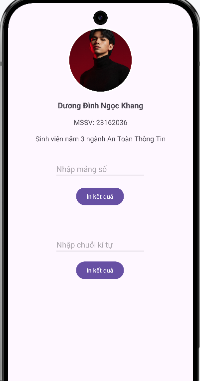
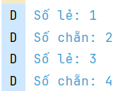
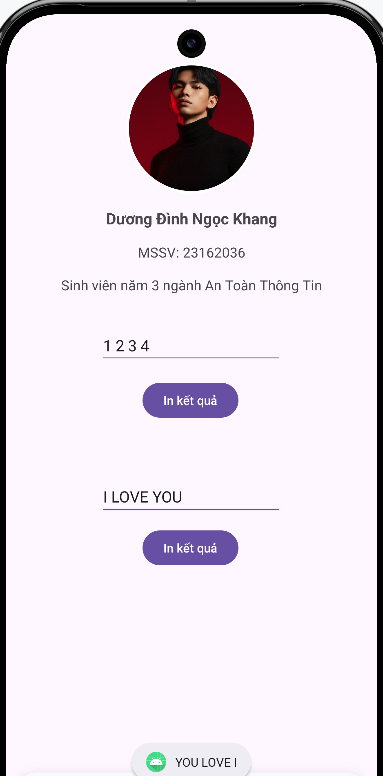

# Baitap01 – Android Studio

## Thông tin sinh viên

* **Họ tên:** Dương Đình Ngọc Khang
* **MSSV:** 23162036

---

## Yêu cầu bài tập

✅ Tạo project trên Android Studio
✅ Hiển thị hình + thông tin sinh viên trên app
✅ Ảnh bo tròn sử dụng thư viện:

```gradle
implementation 'de.hdodenhof:circleimageview:3.1.0'
```

✅ Ẩn **ActionBar**
✅ Nhập **mảng số** (ví dụ: `1,2,3,4,5`)
→ In ra Logcat số **chẵn / lẻ** (**EVEN / ODD**)

✅ Nhập **chuỗi bất kỳ**
→ Đảo ngược chuỗi và **in hoa**

---

## Xử lý chính (code tóm tắt)

### Phân loại số chẵn / lẻ

```kotlin
if (num % 2 == 0) {
  Log.d("EvenNumber", "Số chẵn: " + num);
} else {
  Log.d("OddNumber", "Số lẻ: " + num);
}
```

### Đảo ngược chuỗi + in hoa

```kotlin
ArrayList<String> reversed = new ArrayList<>();
Collections.addAll(reversed, words);
Collections.reverse(reversed);
String reversedString = String.join(" ", reversed).toUpperCase();```
---
```

## Cách chạy ứng dụng

1. Mở **Android Studio**
2. Chạy app trên **máy ảo AVD** hoặc **thiết bị thật**
3. Nhấn **Run ▶** để chạy ứng dụng

---

## Kết quả đạt được

* Hiển thị thông tin sinh viên + ảnh bo tròn đẹp


  
* In số chẵn / lẻ ra **Logcat** với tag `EVEN` / `ODD`


  


* Đảo ngược chuỗi và in hoa kết quả trên màn hình


    
---

>  Bài tập Android cơ bản – luyện tập thao tác UI, xử lý dữ liệu số và chuỗi.
